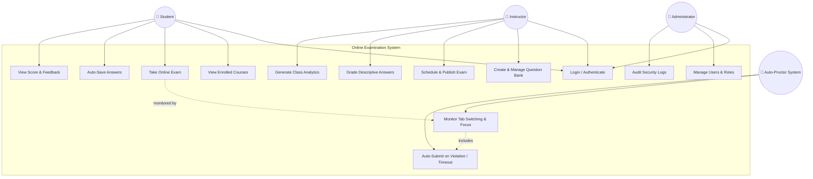
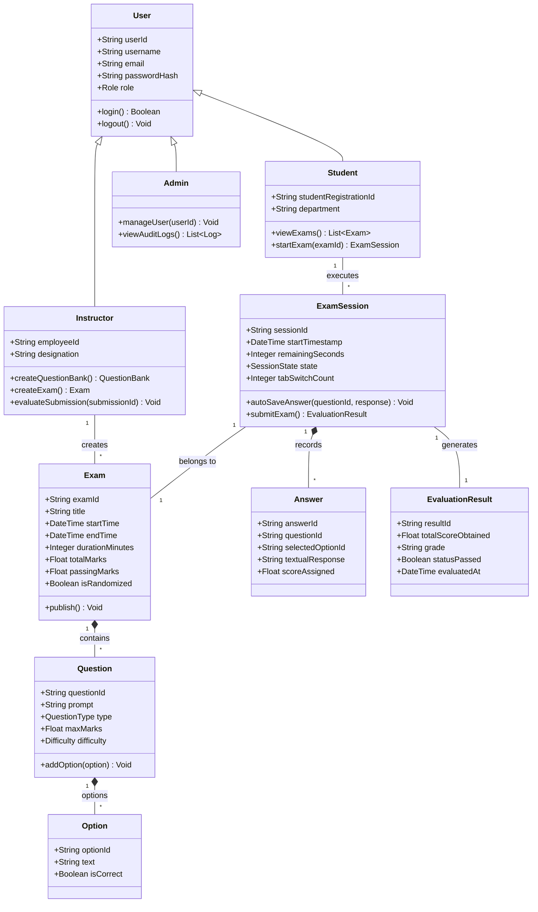
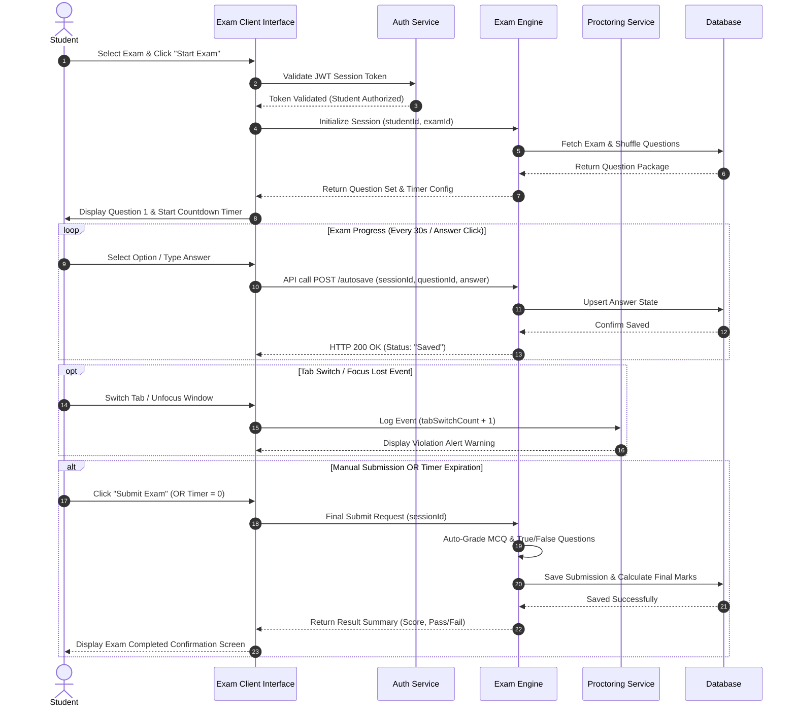
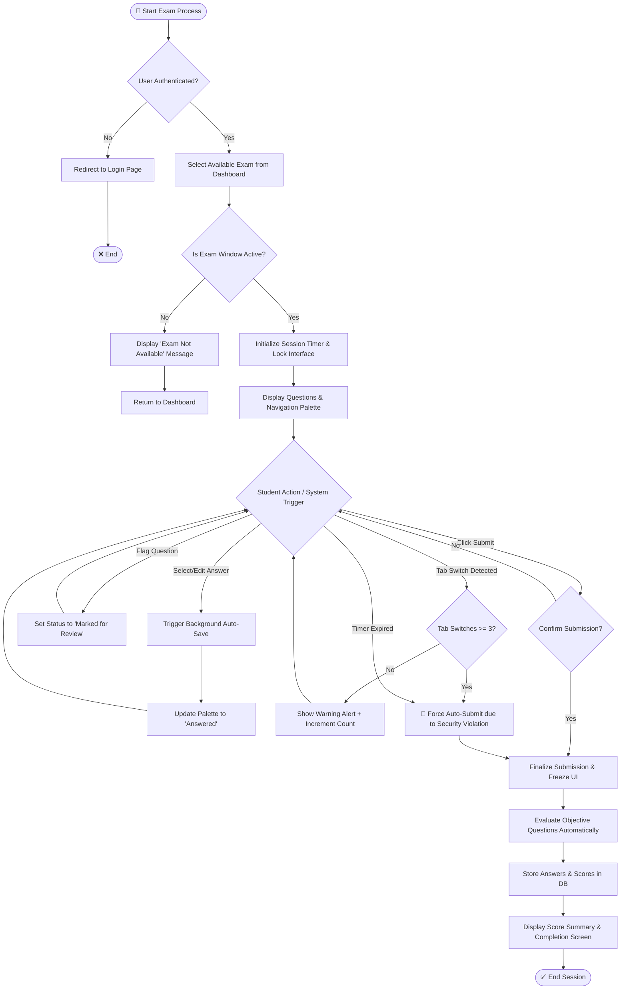

# System Architecture & UML Design Diagrams

This document presents 4 complete, renderable UML diagrams for the **Online Examination System**, constructed using [Mermaid.js](https://mermaid.js.org/).

---

## 1. Use Case Diagram

The Use Case diagram specifies the functional boundary of the system and primary actor interactions (Student, Instructor, Admin, and Auto-Proctor System).

---

## 2. Class Diagram

The Class diagram details the domain model, entity relationships, attribute types, and key operational methods.

---

## 3. Sequence Diagram (Exam Execution & Auto-Grading)

This diagram details the sequence of interactions when a student initializes, completes, auto-saves, and submits an online exam.

---

## 4. Activity Diagram (Student Exam Session Flow)

This diagram highlights the decision workflow, state transitions, security verification, and auto-submission mechanisms during an examination session.

